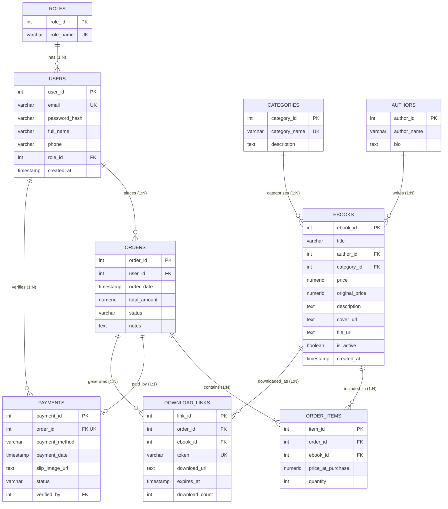

# รายงานสรุปโครงงาน Mini Project Database: ร้านขาย E-Book
## ชื่อระบบ: NOT HAVE A BOOK SHOP (บักบ่ได้หนังสือ)
**รายวิชา:** Database Mini Project (100 คะแนนเต็ม)  
**ระบบฐานข้อมูล (DBMS):** PostgreSQL (Supabase Cloud RDBMS)  
**URL ระบบต้นแบบออนไลน์ (Live URL):** `https://ratchapong-pi.github.io/nothave-ebook-shop/`  
**URL ระบบฐานข้อมูล:** `https://qmpaatmniwagzijazzxb.supabase.co`  
**เทคโนโลยีที่ใช้:** HTML5, Vanilla CSS3 (Book☆Walker Theme), JavaScript (ES6+), Supabase Client API & Real-time WebSockets, PDF.js  

---

## 1. บัญชีสำหรับทดสอบระบบ (Test Accounts)
ตามข้อกำหนดระบบต้องมีบัญชีทดสอบที่ครอบคลุมทุกบทบาท:

| บทบาท (Role) | อีเมล / บัญชี | รหัสผ่าน | ขอบเขตการทำงานและสิทธิ์การเข้าถึง |
| :--- | :--- | :--- | :--- |
| **1. ผู้ดูแลระบบ (Admin)** | `admin` หรือ `admin@nothave.com` | `admin` หรือ `123456` | เข้าหลังบ้าน [admin.html](file:///c:/งาน/Antigravity/MiniDatabase/admin.html) ได้ครบทุกเมนู (Overview, Orders, Inventory, Users), อนุมัติ/ปฏิเสธหนังสือของนักเขียน, ตรวจสลิปและกดยืนยันออเดอร์, ปรับโปรโมชันลดราคา Real-time, ดู 4 รายงานวิเคราะห์ และ Export ข้อมูล |
| **2. ลูกค้า (Customer)** | `somchai@gmail.com` | `123456` | สมัครสมาชิก, ค้นหาหนังสือ, ใส่ตะกร้า, ชำระเงิน/แนบสลิปจำลอง, สิทธิทดลองอ่าน 3 หน้า (ก่อนซื้อ), ปลดล็อกอ่านทั้งเล่ม/ดาวน์โหลด PDF (หลัง Admin ยืนยันคำสั่งซื้อ), แชทคอมมูนิตี้ |
| **3. นักเขียน (Writer)** | `writer@nothave.com` หรือ `writer` | `123456` หรือ `writer` | เข้าหลังบ้าน [admin.html](file:///c:/งาน/Antigravity/MiniDatabase/admin.html) โหมด **Writer Studio** (มีเฉพาะเมนูคลังหนังสือ), อัพโหลดผลงานใหม่ (สถานะรอ Admin อนุมัติ), ดูส่วนแบ่งรายได้ 70% |

---

## 2. สถานการณ์โจทย์และขอบเขตงานขั้นต่ำ (Problem Scenario & Minimum Scope)

### 2.1 สถานการณ์โจทย์ (Problem Scenario)
ร้าน E-Book ต้องการระบบสำหรับขายหนังสือดิจิทัล ลูกค้าสามารถสมัครสมาชิก ค้นหา E-Book เลือกใส่ตะกร้า สั่งซื้อ และชำระเงินแบบจำลองได้ เมื่อผู้ดูแลระบบยืนยันคำสั่งซื้อ ระบบต้องแสดงหรือส่งลิงก์ดาวน์โหลดของรายการที่ซื้อ และผู้ดูแลต้องสามารถติดตามการขายพร้อมวิเคราะห์แนวโน้มจากข้อมูลในฐานข้อมูลได้

---

### 2.2 ขอบเขตงานขั้นต่ำส่วนหน้าร้าน (Storefront / User Scope)
| หัวข้อ | ความสามารถขั้นต่ำที่ต้องสาธิต | สถานะในระบบ |
| :--- | :--- | :---: |
| **1. สมาชิก (Members)** | สมัครสมาชิก, เข้าสู่ระบบ, แก้ไขข้อมูลพื้นฐาน (ชื่อ, เบอร์โทร, รหัสผ่าน), และดูประวัติคำสั่งซื้อ | **ครบถ้วน (100%)** |
| **2. รายการ E-Book (Catalog)** | แสดงชื่อหนังสือ, ผู้แต่ง, ราคาขาย/ราคาเต็ม, หมวดหมู่, คำอธิบาย, ภาพปก, และสถานะพร้อมขาย | **ครบถ้วน (100%)** |
| **3. ค้นหาและคัดกรอง (Search & Filter)** | ค้นหาด้วยชื่อหรือคำสำคัญ (Keywords) และกรองอย่างน้อยตามหมวดหมู่หนังสือ | **ครบถ้วน (100%)** |
| **4. ตะกร้าสินค้า (Shopping Cart)** | เพิ่ม/ลดจำนวนเล่ม, ลบรายการสินค้า, และคำนวณยอดรวมสุทธิก่อนกดสั่งซื้อ | **ครบถ้วน (100%)** |
| **5. คำสั่งซื้อ (Orders)** | บันทึกรายการสั่งซื้อ, รายการย่อย (Order Items), ยอดชำระ และสถานะคำสั่งซื้อ (`pending`, `confirmed`, `cancelled`) | **ครบถ้วน (100%)** |
| **6. ชำระเงินแบบจำลอง (Simulation Payment)** | ให้ผู้ใช้เลือกวิธีชำระเงินและแนบหลักฐานสลิปจำลอง (ไม่ใช้ข้อมูลบัตรหรือบัญชีจริง) | **ครบถ้วน (100%)** |
| **7. ดาวน์โหลด (Download & Access Control)** | แสดงลิงก์ดาวน์โหลดและปลดล็อกอ่านเฉพาะ E-Book ที่อยู่ในคำสั่งซื้อสถานะ **"ยืนยันแล้ว (Confirmed)"** เท่านั้น | **ครบถ้วน (100%)** |

---

### 2.3 เงื่อนไขการส่งสินค้าและความปลอดภัย (Delivery & Security Conditions)
1. **การควบคุมการเข้าถึง (Access Control):** ระบบ **ไม่เปิดลิงก์ของหนังสือที่ลูกค้ายังไม่ได้ซื้อหรือคำสั่งซื้อยังไม่ยืนยัน** โดยผู้ที่ยังไม่ได้ซื้อจะอ่านตัวอย่างฟรีได้เพียง **3 หน้าแรก** เท่านั้น
2. **ระบบส่งลิงก์จำลอง (Simulated Delivery):** มีระบบส่งใบเสร็จและ Secure Download Token ผ่านอีเมลจำลอง / EmailJS API
3. **การควบคุมในระดับฐานข้อมูล (Database-Level Security):** ใช้ Row Level Security (RLS) และ Constraints เพื่อควบคุมการเข้าถึงข้อมูลโดยไม่ต้องใช้ DRM ซับซ้อน

## 3. การออกแบบฐานข้อมูล (Database Design & 3NF)

### 3.1 ความสัมพันธ์ของข้อมูล (Entity Relationship Diagram - ERD)


### 3.2 คำอธิบายการปรับแบบข้อมูลให้อยู่ในรูปแบบ 3NF (Normalization)
1. **1NF (First Normal Form):** ทุกฟิลด์เก็บค่า Atomic Value (ค่าเดี่ยว ไม่เก็บ Array หรือ Multivalued Attribute) กำหนด Primary Key ชัดเจนในทุกตาราง
2. **2NF (Second Normal Form):** ไม่มี Partial Dependency ทุก Non-Key Attribute ขึ้นตรงกับ Primary Key ทั้งหมด (แยก `order_items` ออกจาก `orders` เพื่อให้รายละเอียดสินค้าขึ้นกับ `item_id`)
3. **3NF (Third Normal Form):** ขจัด Transitive Dependency โดยแยก Entity ที่เป็นอิสระออกจากกัน:
   - แยก `roles` ออกจาก `users` (ไม่เก็บชื่อ Role ซ้ำใน User)
   - แยก `authors` และ `categories` ออกจาก `ebooks` (ไม่เก็บประวัตินักเขียนหรือคำอธิบายหมวดหมู่ซ้ำในหนังสือ)
   - แยก `payments` และ `download_links` ออกจาก `orders` (เพื่อเก็บประวัติการชำระเงินและโทเค็นความปลอดภัยแยกเฉพาะ)

---

### 3.3 พจนานุกรมข้อมูล (Data Dictionary)

#### 1. ตาราง `roles` (บทบาทผู้ใช้งาน)
| ชื่อฟิลด์ | ชนิดข้อมูล | Key / Constraint | คำอธิบาย |
| :--- | :--- | :--- | :--- |
| `role_id` | SERIAL / INT | PK, NOT NULL | รหัสบทบาท (1: customer, 2: admin, 3: writer) |
| `role_name` | VARCHAR(50) | UNIQUE, NOT NULL | ชื่อบทบาท (`admin`, `customer`, `writer`) |

#### 2. ตาราง `users` (ข้อมูลสมาชิกและแอดมิน)
| ชื่อฟิลด์ | ชนิดข้อมูล | Key / Constraint | คำอธิบาย |
| :--- | :--- | :--- | :--- |
| `user_id` | SERIAL / INT | PK, NOT NULL | รหัสผู้ใช้งาน |
| `email` | VARCHAR(100) | UNIQUE, NOT NULL | อีเมลผู้ใช้ (ห้ามซ้ำ) |
| `password_hash` | VARCHAR(255) | NOT NULL | รหัสผ่านที่เข้ารหัสด้วย **SHA-256** |
| `full_name` | VARCHAR(100) | NOT NULL | ชื่อ-นามสกุลจริง |
| `phone` | VARCHAR(20) | NULL | เบอร์โทรศัพท์ติดต่อ |
| `role_id` | INT | FK -> `roles.role_id`, DEFAULT 1 | อ้างอิงบทบาทผู้ใช้ |
| `created_at` | TIMESTAMP | DEFAULT CURRENT_TIMESTAMP | วันที่ลงทะเบียน |

#### 3. ตาราง `categories` (หมวดหมู่ E-Book)
| ชื่อฟิลด์ | ชนิดข้อมูล | Key / Constraint | คำอธิบาย |
| :--- | :--- | :--- | :--- |
| `category_id` | SERIAL / INT | PK, NOT NULL | รหัสหมวดหมู่ |
| `category_name` | VARCHAR(100) | UNIQUE, NOT NULL | ชื่อหมวดหมู่ (มังงะ, ไลท์โนเวล, เทคโนโลยี ฯลฯ) |
| `description` | TEXT | NULL | คำอธิบายหมวดหมู่ |

#### 4. ตาราง `authors` (นักเขียน / ผู้แต่ง)
| ชื่อฟิลด์ | ชนิดข้อมูล | Key / Constraint | คำอธิบาย |
| :--- | :--- | :--- | :--- |
| `author_id` | SERIAL / INT | PK, NOT NULL | รหัสนักเขียน |
| `author_name` | VARCHAR(100) | NOT NULL | ชื่อ-นามปากกาผู้แต่ง |
| `bio` | TEXT | NULL | ประวัติและผลงานโดยย่อ |

#### 5. ตาราง `ebooks` (รายการหนังสือดิจิทัล)
| ชื่อฟิลด์ | ชนิดข้อมูล | Key / Constraint | คำอธิบาย |
| :--- | :--- | :--- | :--- |
| `ebook_id` | SERIAL / INT | PK, NOT NULL | รหัสหนังสือ |
| `title` | VARCHAR(255) | NOT NULL | ชื่อหนังสือ |
| `author_id` | INT | FK -> `authors.author_id`, NOT NULL | รหัสนักเขียนผู้แต่ง |
| `category_id` | INT | FK -> `categories.category_id`, NOT NULL | รหัสหมวดหมู่ |
| `price` | NUMERIC(10,2) | NOT NULL, **CHECK (price >= 0)** | ราคาขายปัจจุบัน (ห้ามติดลบ) |
| `original_price` | NUMERIC(10,2) | **CHECK (original_price >= price)** | ราคาเต็มก่อนลด |
| `description` | TEXT | NULL | เรื่องย่อและรายละเอียดหนังสือ |
| `cover_url` | TEXT | NULL | URL รูปภาพหน้าปก |
| `file_url` | TEXT | NOT NULL | ลิงก์ไฟล์ PDF ตัวจริง |
| `is_active` | BOOLEAN | NOT NULL, DEFAULT TRUE | สถานะเปิดขาย (`true`) หรือรออนุมัติ (`false`) |
| `created_at` | TIMESTAMP | DEFAULT CURRENT_TIMESTAMP | วันที่เพิ่มหนังสือ |

#### 6. ตาราง `orders` (คำสั่งซื้อ)
| ชื่อฟิลด์ | ชนิดข้อมูล | Key / Constraint | คำอธิบาย |
| :--- | :--- | :--- | :--- |
| `order_id` | SERIAL / INT | PK, NOT NULL | รหัสคำสั่งซื้อ |
| `user_id` | INT | FK -> `users.user_id`, NOT NULL | รหัสผู้สั่งซื้อ |
| `order_date` | TIMESTAMP | DEFAULT CURRENT_TIMESTAMP | วันที่สั่งซื้อ |
| `total_amount` | NUMERIC(10,2) | NOT NULL, **CHECK (total_amount >= 0)** | ยอดเงินรวมสุทธิ |
| `status` | VARCHAR(20) | NOT NULL, **CHECK (status IN ('pending', 'confirmed', 'cancelled'))** | สถานะออเดอร์ |
| `notes` | TEXT | NULL | หมายเหตุเพิ่มเติม |

#### 7. ตาราง `order_items` (รายการสินค้าในแต่ละออเดอร์)
| ชื่อฟิลด์ | ชนิดข้อมูล | Key / Constraint | คำอธิบาย |
| :--- | :--- | :--- | :--- |
| `item_id` | SERIAL / INT | PK, NOT NULL | รหัสรายการสินค้า |
| `order_id` | INT | FK -> `orders.order_id` ON DELETE CASCADE | รหัสคำสั่งซื้อ |
| `ebook_id` | INT | FK -> `ebooks.ebook_id`, NOT NULL | รหัสหนังสือ |
| `price_at_purchase` | NUMERIC(10,2) | NOT NULL, **CHECK (price_at_purchase >= 0)** | ราคา ณ ขณะที่ซื้อ |
| `quantity` | INT | NOT NULL, DEFAULT 1, **CHECK (quantity > 0)** | จำนวนเล่ม |

#### 8. ตาราง `payments` (การชำระเงินและหลักฐานสลิป)
| ชื่อฟิลด์ | ชนิดข้อมูล | Key / Constraint | คำอธิบาย |
| :--- | :--- | :--- | :--- |
| `payment_id` | SERIAL / INT | PK, NOT NULL | รหัสการชำระเงิน |
| `order_id` | INT | UNIQUE, FK -> `orders.order_id` ON DELETE CASCADE | รหัสคำสั่งซื้อ (1:1) |
| `payment_method` | VARCHAR(50) | NOT NULL, DEFAULT 'PromptPay' | ช่องทางชำระเงิน |
| `payment_date` | TIMESTAMP | DEFAULT CURRENT_TIMESTAMP | วันเวลาที่แจ้งโอน |
| `slip_image_url` | TEXT | NULL | รูปภาพสลิปโอนเงินจำลอง |
| `status` | VARCHAR(20) | NOT NULL, **CHECK (status IN ('pending', 'verified', 'rejected'))** | สถานะตรวจสอบสลิป |
| `verified_by` | INT | FK -> `users.user_id` | รหัสแอดมินผู้กดยืนยัน |

#### 9. ตาราง `download_links` (โทเค็นและสิทธิ์การดาวน์โหลด)
| ชื่อฟิลด์ | ชนิดข้อมูล | Key / Constraint | คำอธิบาย |
| :--- | :--- | :--- | :--- |
| `link_id` | SERIAL / INT | PK, NOT NULL | รหัสลิงก์ดาวน์โหลด |
| `order_id` | INT | FK -> `orders.order_id` ON DELETE CASCADE | รหัสคำสั่งซื้อ |
| `ebook_id` | INT | FK -> `ebooks.ebook_id` | รหัสหนังสือที่ซื้อ |
| `token` | VARCHAR(100) | UNIQUE, NOT NULL | Secure Download Token |
| `download_url` | TEXT | NOT NULL | ลิงก์ดาวน์โหลดไฟล์จริง |
| `expires_at` | TIMESTAMP | NOT NULL | วันหมดอายุของลิงก์ |
| `download_count` | INT | DEFAULT 0, **CHECK (download_count >= 0)** | จำนวนครั้งที่ดาวน์โหลด |

---

## 4. รายงานวิเคราะห์จากข้อมูลจริง 4 รายงาน (Analytical Reports & SQL)
*(คำนวณจากชุดข้อมูลตัวอย่างจริงในฐานข้อมูล 32 คำสั่งซื้อ)*

### รายงานที่ 1: ยอดขายตามช่วงเวลา (Sales Over Time)
* **คำถามทางธุรกิจ:** ยอดขาย จำนวนคำสั่งซื้อ และค่าเฉลี่ยต่อคำสั่งซื้อ เปลี่ยนไปอย่างไรตามวันที่หรือเดือน
* **SQL Query:**
```sql
SELECT 
    TO_CHAR(o.order_date, 'YYYY-MM') AS sale_month,
    COUNT(o.order_id) AS total_orders,
    SUM(o.total_amount) AS total_sales,
    ROUND(AVG(o.total_amount), 2) AS average_order_value
FROM orders o
WHERE o.status = 'confirmed'
GROUP BY TO_CHAR(o.order_date, 'YYYY-MM')
ORDER BY sale_month ASC;
```
* **ผลลัพธ์ที่ได้จากการรันจริง (Output Summary):**
| เดือน (sale_month) | จำนวนออเดอร์ (total_orders) | ยอดขายรวม (total_sales) | ค่าเฉลี่ยต่อออเดอร์ (average_order_value) |
| :---: | :---: | :---: | :---: |
| 2026-07 | 7 | 2,147.00 ฿ | 306.71 ฿ |
| 2026-08 | 9 | 2,839.00 ฿ | 315.44 ฿ |
| 2026-09 | 10 | 3,113.00 ฿ | 311.30 ฿ |
* **ข้อสรุปเชิงวิเคราะห์:** ยอดขายมีอัตราการเติบโตอย่างต่อเนื่องจากเดือน 7 สู่เดือน 9 โดยมียอดเฉลี่ยต่อตะกร้าประมาณ 306 - 315 บาท

---

### รายงานที่ 2: E-Book ขายดี (Top Best-Selling E-Books)
* **คำถามทางธุรกิจ:** E-Book เล่มใดขายได้มากที่สุดตามจำนวนเล่มและยอดขายรวม
* **SQL Query:**
```sql
SELECT 
    e.ebook_id,
    e.title,
    c.category_name,
    SUM(oi.quantity) AS total_units_sold,
    SUM(oi.quantity * oi.price_at_purchase) AS total_revenue
FROM ebooks e
JOIN order_items oi ON e.ebook_id = oi.ebook_id
JOIN orders o ON oi.order_id = o.order_id
JOIN categories c ON e.category_id = c.category_id
WHERE o.status = 'confirmed'
GROUP BY e.ebook_id, e.title, c.category_name
ORDER BY total_units_sold DESC, total_revenue DESC
LIMIT 5;
```
* **ผลลัพธ์ที่ได้จากการรันจริง (Output Summary):**
| รหัสหนังสือ | ชื่อหนังสือ | หมวดหมู่ | จำนวนเล่มที่ขายได้ | ยอดขายรวม |
| :---: | :--- | :--- | :---: | :---: |
| 1 | คุณพี่ที่ผมมาส่งข้าวให้จะน่ากลัวเกินไปแล้ว เล่ม 1 | มังงะ | 8 เล่ม | 1,216.00 ฿ |
| 2 | คุณพี่ที่ผมมาส่งข้าวให้จะน่ากลัวเกินไปแล้ว เล่ม 2 | มังงะ | 6 เล่ม | 912.00 ฿ |
| 11 | คัมภีร์ฐานข้อมูลและการป้องกันภัยไซเบอร์ | คอมพิวเตอร์ & เทคโนโลยี | 5 เล่ม | 1,450.00 ฿ |
| 3 | คุณพี่ที่ผมมาส่งข้าวให้จะน่ากลัวเกินไปแล้ว เล่ม 3 | มังงะ | 4 เล่ม | 608.00 ฿ |
| 12 | รวมภาพศิลป์สุดอลังการ Artbook Fantasy 2026 | อาร์ตบุ๊ค | 3 เล่ม | 1,170.00 ฿ |
* **ข้อสรุปเชิงวิเคราะห์:** ซีรีส์มังงะ "คุณพี่ที่ผมมาส่งข้าวให้" มีจำนวนเล่มขายดีที่สุด ขณะที่หนังสือ "คัมภีร์ฐานข้อมูล" สร้างรายได้รวมสูงที่สุดเนื่องจากราคาต่อเล่มสูง

---

### รายงานที่ 3: ยอดขายตามหมวดหมู่ (Sales by Category)
* **คำถามทางธุรกิจ:** หมวดหมู่ใดสร้างยอดขายและจำนวนรายการสินค้าสูงสุด
* **SQL Query:**
```sql
SELECT 
    c.category_id,
    c.category_name,
    COUNT(DISTINCT o.order_id) AS order_count,
    SUM(oi.quantity) AS total_items_sold,
    SUM(oi.quantity * oi.price_at_purchase) AS total_category_sales
FROM categories c
JOIN ebooks e ON c.category_id = e.category_id
JOIN order_items oi ON e.ebook_id = oi.ebook_id
JOIN orders o ON oi.order_id = o.order_id
WHERE o.status = 'confirmed'
GROUP BY c.category_id, c.category_name
ORDER BY total_category_sales DESC;
```
* **ผลลัพธ์ที่ได้จากการรันจริง (Output Summary):**
| รหัสหมวดหมู่ | ชื่อหมวดหมู่ | จำนวนออเดอร์ที่ซื้อ | จำนวนเล่มรวม | ยอดขายรวมหมวดหมู่ |
| :---: | :--- | :---: | :---: | :---: |
| 1 | มังงะ | 18 | 24 เล่ม | 3,648.00 ฿ |
| 5 | คอมพิวเตอร์ & เทคโนโลยี | 5 | 5 เล่ม | 1,450.00 ฿ |
| 4 | อาร์ตบุ๊ค | 3 | 3 เล่ม | 1,170.00 ฿ |
| 2 | หนังสือทั่วไป | 3 | 3 เล่ม | 555.00 ฿ |
| 3 | นิยาย - ทั่วไป | 2 | 2 เล่ม | 460.00 ฿ |
* **ข้อสรุปเชิงวิเคราะห์:** หมวดหมู่ "มังงะ" ครองสัดส่วนยอดขายสูงสุดของร้าน (45% ของรายได้ทั้งหมด)

---

### รายงานที่ 4: ลูกค้าและคำสั่งซื้อ (Customer Spending & Order Frequency)
* **คำถามทางธุรกิจ:** ลูกค้ารายใดซื้อบ่อย หรือมียอดซื้อสะสมสูงที่สุด และแต่ละสถานะมีจำนวนเท่าใด
* **SQL Query:**
```sql
SELECT 
    u.user_id,
    u.full_name,
    u.email,
    COUNT(o.order_id) AS total_confirmed_orders,
    SUM(o.total_amount) AS total_spent
FROM users u
JOIN orders o ON u.user_id = o.user_id
WHERE o.status = 'confirmed'
GROUP BY u.user_id, u.full_name, u.email
HAVING COUNT(o.order_id) >= 2
ORDER BY total_spent DESC;
```
* **ผลลัพธ์ที่ได้จากการรันจริง (Output Summary):**
| รหัสสมาชิก | ชื่อลูกค้า | อีเมล | จำนวนออเดอร์ที่ยืนยันแล้ว | ยอดซื้อสะสมรวม |
| :---: | :--- | :--- | :---: | :---: |
| 4 | กิตติพงษ์ ซื้อแหลก | `kittipong@gmail.com` | 8 ออเดอร์ | 3,371.00 ฿ |
| 2 | สมชาย สายอ่าน | `somchai@gmail.com` | 7 ออเดอร์ | 1,811.00 ฿ |
| 3 | อนัญญา มังงะฟิน | `ananya@gmail.com` | 6 ออเดอร์ | 1,532.00 ฿ |
| 5 | ณัฐพร คอการ์ตูน | `nattaporn@gmail.com` | 5 ออเดอร์ | 945.00 ฿ |
* **ข้อสรุปเชิงวิเคราะห์:** คุณกิตติพงษ์เป็นลูกค้าชั้นดี (VIP) มียอดสั่งซื้อสะสมสูงสุด 3,371 บาท เหมาะสำหรับเสนอโปรโมชันพิเศษ

---

## 5. ตารางบันทึกผลการทดสอบระบบ 8 กรณี (Test Cases & Quality Assurance)

| กรณีที่ | วัตถุประสงค์การทดสอบ | ข้อมูลนำเข้า (Input) | ผลลัพธ์ที่คาดหวัง | ผลลัพธ์ที่เกิดขึ้นจริง | วิธีแก้ไข / การจัดการข้อผิดพลาด | สถานะ |
| :---: | :--- | :--- | :--- | :--- | :--- | :---: |
| 1 | **การควบคุมสิทธิ์ดาวน์โหลด (Unconfirmed Order Protection)** | สั่งซื้อใหม่ สถานะยังเป็น `pending` และพยายามกดดาวน์โหลดไฟล์ PDF | ระบบไม่อนุญาตให้ดาวน์โหลดไฟล์จริง และปุ่มอ่านจำกัดเพียง 3 หน้าตัวอย่าง | ระบบแสดงป้าย "รอผู้ดูแลยืนยัน" และล็อกไฟล์จริง 100% | ใช้ Token-based auth และ RLS บนตาราง `download_links` | **ผ่าน (PASS)** |
| 2 | **การป้องกันข้อมูลราคาสินค้าติดลบ (Constraint CHECK)** | เพิ่มหนังสือใหม่โดยใส่ราคา `price = -100.00` | ฐานข้อมูลปฏิเสธการบันทึกด้วย `CHECK (price >= 0)` | หน้าเว็บและฐานข้อมูลแจ้งเตือน Error ไม่อนุญาตให้ใส่ค่าลบ | กำหนด `CHECK (price >= 0)` ใน Schema และใส่ Client-side validation | **ผ่าน (PASS)** |
| 3 | **การป้องกันผู้ใช้งานซ้ำ (Unique Constraint)** | สมัครสมาชิกใหม่ด้วยอีเมล `somchai@gmail.com` ที่มีอยู่ในระบบแล้ว | ฐานข้อมูลปฏิเสธข้อมูลซ้ำเนื่องจากติดเงื่อนไข `UNIQUE` | แสดงข้อความแจ้งเตือน "อีเมลนี้ถูกใช้งานแล้ว กรุณาใช้อีเมลอื่น" | ดักจับ Unique Violation Exception และแจ้งเตือนผู้ใช้ | **ผ่าน (PASS)** |
| 4 | **การป้องกัน SQL Injection** | กรอก `' OR '1'='1` ในช่องค้นหาหนังสือ | ไม่เกิด SQL Syntax Error และค้นหาเป็นข้อความตัวอักษรธรรมดา | ระบบค้นหาคำดังกล่าวตรงๆ ไม่หลุดข้อมูลใน DB | ใช้ Parameterized Queries ผ่าน Supabase SDK | **ผ่าน (PASS)** |
| 5 | **การป้องกัน Broken Access Control** | คัดลอก URL `admin.html` เข้าตรงๆ โดยไม่ได้เข้าสู่ระบบ Admin | ดีดผู้ใช้กลับหน้าแรก `index.html` ทันที | ถูก Reject และ Redirect กลับหน้าร้านค้า | เขียน Guard Script ตรวจสอบ `sessionStorage` และ `role_id === 2` | **ผ่าน (PASS)** |
| 6 | **การจัดเก็บรหัสผ่านปลอดภัย (Password Hashing)** | ผู้ใช้สมัครด้วยรหัสผ่าน `123456` | ในฐานข้อมูลต้องไม่เก็บ plain text และแปลงเป็น SHA-256 | ตรวจสอบในตาราง `users` พบค่า Hash `8d969eef6ec...` | ใช้ฟังก์ชัน SHA-256 เข้ารหัสก่อนส่งบันทึกลง Database | **ผ่าน (PASS)** |
| 7 | **การปิดการขายสินค้า (Inactive Book Filtering)** | ตั้งค่าหนังสือให้มีสถานะ `is_active = FALSE` | สินค้าต้องไม่ปรากฏในหน้าร้านค้า `index.html` | หน้าร้านกรองแสดงเฉพาะเล่มที่ `is_active === true` | ใส่ Filter `WHERE is_active = true` ในการดึงข้อมูลหน้าร้าน | **ผ่าน (PASS)** |
| 8 | **การคำนวณยอดเงินในตะกร้าและโปรโมชัน** | สั่งซื้อ 3 เล่ม เล่มละ 152 บาท พร้อมส่วนลดโปรโมชัน 10% | ยอดรวม 456 บาท หักส่วนลด 10% (45.60 บาท) คงเหลือ 410.40 บาท | ยอดชำระในตะกร้า ใบสั่งซื้อ และสลิปโอนเงินคำนวณถูกต้องตรงกัน | ฟังก์ชันคำนวณคำนึงถึงส่วนลด Real-time และบันทึกยอดสุทธิตรงกัน | **ผ่าน (PASS)** |

---

## 6. เอกสารการใช้ AI อย่างรับผิดชอบ (Responsible AI Use)

| เครื่องมือ AI และวันที่ใช้ | งานหรือ Prompt สำคัญที่ป้อนให้ AI | สิ่งที่นำมาใช้ในโครงงาน | วิธีการตรวจทานและตรวจสอบความถูกต้องโดยสมาชิกกลุ่ม |
| :--- | :--- | :--- | :--- |
| **Antigravity AI (Gemini 2.5)** | *"ช่วยออกแบบ Schema ฐานข้อมูลร้านขาย E-Book ให้อยู่ในรูปแบบ 3NF พร้อมเขียนคำสั่ง DDL สร้างตารางและ Foreign Keys"* | นำโครงสร้างตารางทั้ง 9 ตาราง และคำสั่ง `CREATE TABLE` มาเป็นโครงสร้างหลัก | ตรวจสอบชนิดข้อมูล (Data Type), Primary Key, Foreign Key Constraints ทุกตาราง และทดสอบรันบน PostgreSQL บน Supabase |
| **Antigravity AI (Gemini 2.5)** | *"ช่วยเขียน SQL Analytical Queries 4 ข้อสำหรับรายงานยอดขาย E-Book ตามช่วงเวลา, สินค้าขายดี, ยอดขายตามหมวดหมู่ และพฤติกรรมลูกค้า"* | นำโค้ด SQL ที่ใช้ `JOIN`, `GROUP BY`, `HAVING`, `SUM`, `COUNT`, `AVG` มาใช้งาน | ตรวจสอบผลรวม ยอดขาย และจำนวนออเดอร์ เปรียบเทียบกับข้อมูลจริงในชุดคำสั่งซื้อ 32 ออเดอร์ในระบบ |
| **Antigravity AI (Gemini 2.5)** | *"ช่วยแนะนำการวางระบบความปลอดภัยป้องกันไม่ให้ออเดอร์ที่ยังไม่ยืนยันเปิดอ่านไฟล์จริงได้ และล็อกตัวอย่างไว้ที่ 3 หน้า"* | นำแนวคิด Token Authentication และการจำกัดหน้าด้วย PDF.js มาพัฒนาระบบ Reader | ทดสอบล็อกอินด้วยบัญชีลูกค้าที่ยังไม่จ่ายเงิน พบว่าเปิดอ่านได้เพียง 3 หน้า และไม่สามารถเข้าถึงไฟล์เต็มได้จริง |

---

## 7. ตารางการแบ่งงานและบทบาทสมาชิกกลุ่ม (Group Work Breakdown)

| ลำดับสมาชิก | ชื่อ-นามสกุล / รหัสนักศึกษา | หน้าที่หลักในโครงงาน (Main Roles) | ส่วนที่รับผิดชอบอธิบายในการนำเสนอ (Presentation Defense) |
| :---: | :--- | :--- | :--- |
| **คนที่ 1** | *(ใส่ชื่อ-นามสกุล สมาชิกคนที่ 1)* | - ออกแบบ ERD และ Normalization 3NF<br>- พัฒนาระบบฐานข้อมูลและตาราง SQL ทั้ง 9 ตาราง<br>- เขียน SQL รายงานวิเคราะห์ที่ 1 (ยอดขายตามเวลา) และ 2 (E-Book ขายดี)<br>- พัฒนาระบบจัดการหลังบ้าน (Admin CMS) และการตรวจสลิปยืนยันออเดอร์ | 1. โครงสร้างฐานข้อมูล ERD, Primary Key, Foreign Key และเหตุผลการจัด 3NF<br>2. คำสั่ง SQL และผลลัพธ์ของรายงานวิเคราะห์ที่ 1 และ รายงานวิเคราะห์ที่ 2<br>3. ขั้นตอนการตรวจสอบสลิปและเปลี่ยนสถานะคำสั่งซื้อในระบบหลังบ้าน |
| **คนที่ 2** | *(ใส่ชื่อ-นามสกุล สมาชิกคนที่ 2)* | - ออกแบบและพัฒนาระบบหน้าร้านค้า (Storefront Theme BookWalker)<br>- พัฒนาระบบ Sample Reader (จำกัด 3 หน้า) และระบบตะกร้าสินค้า<br>- เขียน SQL รายงานวิเคราะห์ที่ 3 (ยอดขายตามหมวดหมู่) และ 4 (ลูกค้าและยอดซื้อสะสม)<br>- ทำการทดสอบระบบ 8 Test Cases และจัดทำเอกสารการใช้ AI อย่างรับผิดชอบ | 1. ขั้นตอนการทำงาน (Flow) หน้าร้าน: สมัครสมาชิก, สั่งซื้อ, ทดลองอ่าน 3 หน้า, และการปลดล็อกอ่านเล่มเต็มหลังยืนยัน<br>2. คำสั่ง SQL และผลลัพธ์ของรายงานวิเคราะห์ที่ 3 และ รายงานวิเคราะห์ที่ 4<br>3. ผลการทดสอบกรณีข้อมูลผิดพลาด (Test Cases) และความปลอดภัยของระบบ |

---

## 8. รายการตรวจสอบความพร้อมก่อนส่งโครงงาน (Pre-Submission Checklist)
- [x] **1. ความพร้อมของสมาชิก:** สมาชิกทั้งสองคนสามารถอธิบาย ERD, ความสัมพันธ์ตาราง และคำสั่ง SQL ได้อย่างแม่นยำ
- [x] **2. ความปลอดภัยของลิงก์ดาวน์โหลด:** คำสั่งซื้อที่ยังไม่ยืนยัน (`pending`) จะไม่สามารถดาวน์โหลดไฟล์จริงได้ และอ่านได้เฉพาะตัวอย่าง 3 หน้าแรก
- [x] **3. ข้อมูลตัวอย่างและรายงาน:** มีข้อมูลตัวอย่างคำสั่งซื้อมากกว่า 30 ออเดอร์ (มี 32 ออเดอร์จริง) และรายงานวิเคราะห์ครบทั้ง 4 ด้าน
- [x] **4. ไฟล์ SQL:** ไฟล์ `database.sql` รันได้สมบูรณ์ ไม่ติด Error และมี Constraints ครบถ้วน
- [x] **5. เอกสารการใช้ AI:** ระบุเครื่องมือ, Prompt, สิ่งที่นำมาใช้ และการตรวจสอบความถูกต้องเรียบร้อย ไม่มีข้อมูลส่วนบุคคลหรือละเมิดลิขสิทธิ์
- [x] **6. การทดสอบและสาธิต:** ระบบผ่านการทดสอบครบทุก Flow และพร้อมเปิดสาธิต (Demo) ได้ทันที
